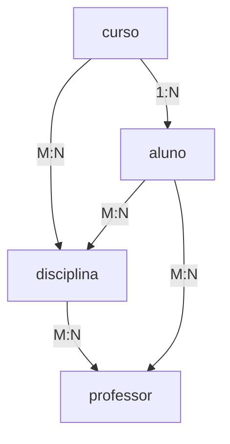

# **Introdução ao Banco de Dados Acadêmico**  

O **Banco de Dados Acadêmico** é um sistema desenvolvido para gerenciar informações educacionais de instituições de ensino, armazenando dados de **alunos, cursos, disciplinas, professores e desempenho acadêmico**. Projetado em **PostgreSQL**, ele permite consultas eficientes para análise de desempenho, acompanhamento de créditos, geração de relatórios e tomada de decisões pedagógicas.  


## 🔗 Relacionamentos Chave



## 💡 Consultas Úteis (Destaques)

### 1. Desempenho por Disciplina
```sql
SELECT d.nome, AVG(a.nota) as média, 
       COUNT(CASE WHEN a.nota >= 6 THEN 1 END) as aprovados,
       COUNT(CASE WHEN a.nota < 6 THEN 1 END) as reprovados
FROM aula a
JOIN disciplina d ON a.disciplina_fk = d.numdisp
GROUP BY d.nome;
```

### 2. Progresso do Aluno
```sql
SELECT a.nome, SUM(d.quantcreditos) as créditos_concluídos
FROM aluno a
JOIN aula au ON a.numaluno = au.aluno_fk
JOIN disciplina d ON au.disciplina_fk = d.numdisp
WHERE au.nota >= 6
GROUP BY a.nome;
```

### 3. Disciplinas por Curso
```sql
SELECT c.nome as curso, STRING_AGG(d.nome, ', ') as disciplinas
FROM curso c
JOIN disciplinacurso dc ON c.id_curso = dc.curso_fk
JOIN disciplina d ON dc.disciplina_fk = d.numdisp
GROUP BY c.nome;
```

## 📊 Métricas Importantes

1. **Taxa de Aprovação**:
   ```sql
   SELECT (COUNT(CASE WHEN nota >= 6 THEN 1 END) * 100.0 / COUNT(*)) as taxa_aprovação
   FROM aula;
   ```

2. **Carga Horária por Aluno**:
   ```sql
   SELECT a.nome, SUM(d.quantcreditos) as total_creditos
   FROM aluno a
   JOIN aula au ON a.numaluno = au.aluno_fk
   JOIN disciplina d ON au.disciplina_fk = d.numdisp
   GROUP BY a.nome;
   ```

3. **Professores com Melhores Médias**:
   ```sql
   SELECT p.nome, AVG(a.nota)::numeric(5,2) as média
   FROM professor p
   JOIN aula a ON p.numprof = a.professor_fk
   GROUP BY p.nome
   ORDER BY média DESC;
